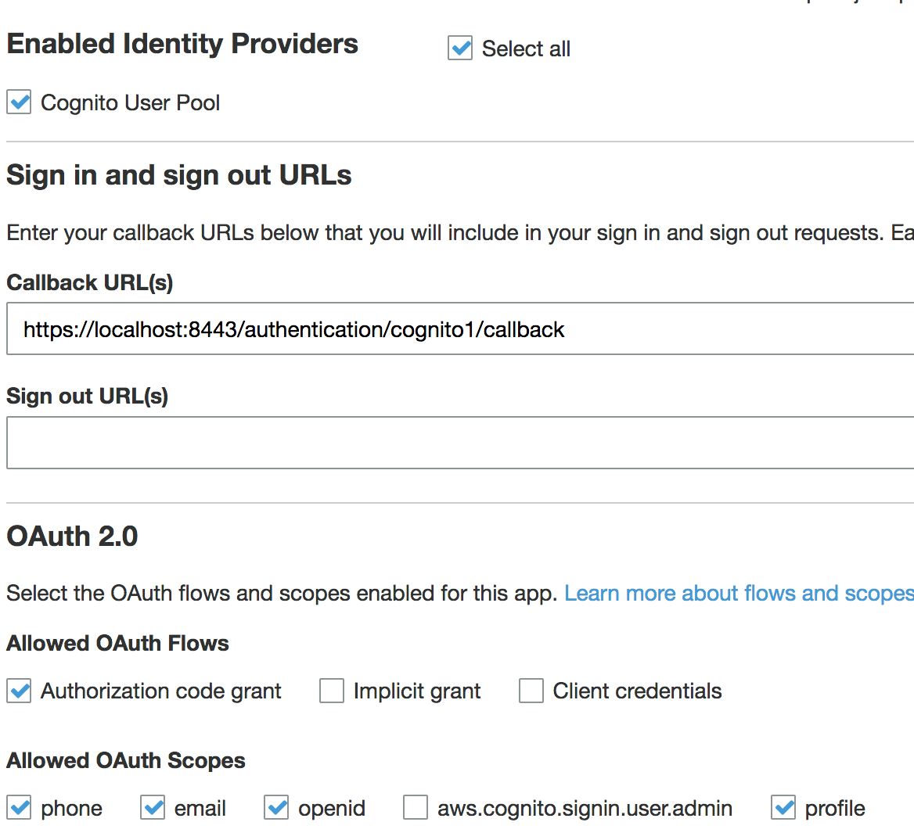

Amazon Cognito Authenticator Plugin
===================================
   
.. image:: https://curity.io/assets/images/badges/aws-authenticator-quality.svg
       :target: https://curity.io/resources/code-examples/status/
       
.. image:: https://curity.io/assets/images/badges/aws-authenticator-availability.svg
       :target: https://curity.io/resources/code-examples/status/

This project provides an open source Amazon Cognito Authenticator plug-in for the Curity Identity Server. This allows an administrator to add functionality to Curity which will then enable end users to login using their StackOverflow, SuperUser, ServerFault or other Amazon Cognito credentials. The app that integrates with Curity may also be configured to receive the Amazon Cognito access token, allowing it to manage Amazon Cognito resources.

System Requirements
~~~~~~~~~~~~~~~~~~~

* Curity Identity Server 2.4.0 and `its system requirements <https://developer.curity.io/docs/latest/system-admin-guide/system-requirements.html>`_

Requirements for Building from Source
"""""""""""""""""""""""""""""""""""""

* Maven 3
* Java JDK v. 8

Compiling the Plug-in from Source
~~~~~~~~~~~~~~~~~~~~~~~~~~~~~~~~~

The source is very easy to compile. To do so from a shell, issue this command: ``mvn package``.

Installation
~~~~~~~~~~~~

To install this plug-in, either download a binary version available from the `releases section of this project's GitHub repository <https://github.com/curityio/aws-authenticator/releases>`_ or compile it from source (as described above). If you compiled the plug-in from source, the package will be placed in the ``target`` subdirectory. The resulting JAR file or the one downloaded from GitHub needs to placed in the directory ``${IDSVR_HOME}/usr/share/plugins/aws``. (The name of the last directory, ``aws``, which is the plug-in group, is arbitrary and can be anything.) After doing so, the plug-in will become available as soon as the node is restarted.

.. note::

    The JAR file needs to be deployed to each run-time node and the admin node. For simple test deployments where the admin node is a run-time node, the JAR file only needs to be copied to one location.

For a more detailed explanation of installing plug-ins, refer to the `Curity developer guide <https://developer.curity.io/docs/latest/developer-guide/plugins/index.html#plugin-installation>`_.

Creating an App in Amazon Cognito
~~~~~~~~~~~~~~~~~~~~~~~~~~~~~~~~~

To create a new app in Amazon Cognito, follow `Amazon Docs <https://docs.aws.amazon.com/cognito/latest/developerguide/getting-started.html>`_.
After you create the App, take note of the ``Client ID``, ``Secret key`` and ``Domain/Url``. These will be needed when configuring Curity.

Amazon Cognito will also display the Authorization callback URL in the new app's configuration. This needs to match the yet-to-be-created Amazon Cognito authenticator instance in Curity. This should be updated to some URL that follows the pattern ``$baseUrl/$authenticationEndpointPath/$awsAuthnticatorId/callback``, where each of these URI components has the following meaning:

============================== =========================================================================================
URI Component                  Meaning
------------------------------ -----------------------------------------------------------------------------------------
``baseUrl``                    The base URL of the server (defined on the ``System --> General`` page of the
                               admin GUI). If this value is not set, then the server scheme, name, and port should be
                               used (e.g., ``https://localhost:8443``).
``authenticationEndpointPath`` The path of the authentication endpoint. In the admin GUI, this is located in the
                               authentication profile's ``Endpoints`` tab for the endpoint that has the type
                               ``auth-authentication``.
``awsAuthenticatorId``         This is the name given to the Amazon Cognito authenticator when defining it
                               (e.g., ``cognito1``).
============================== =========================================================================================

Once the redirect URI is updated, the only thing left is to configure scopes. You need to configure at least one scope `openid`.

    It could be helpful to also enable additional scopes. Scopes are the AWS-related rights or permissions that the app is requesting. If the final application (not Curity, but the downstream app) is going to perform actions using the Amazon Cognito API, additional scopes probably should be enabled. Refer to the `Amazon Cognito documentation on scopes <https://docs.aws.amazon.com/cognito/latest/developerguide/cognito-user-pools-app-idp-settings.html>`_ for an explanation of those that can be enabled and what they allow.

.. warning::

    If the app configuration in Amazon Cognito does not allow a certain scope (e.g., the ``Profile`` scope) but that scope is enabled in the authenticator in Curity, a server error will result. For this reason, it is important to align these two configurations or not to define any when configuring the plug-in in Curity.

Creating an Amazon Cognito Authenticator in Curity
~~~~~~~~~~~~~~~~~~~~~~~~~~~~~~~~~~~~~~~~~~~~~~~~~~

The easiest way to configure a new Amazon Cognito authenticator is using the Curity admin UI. The configuration for this can be downloaded as XML or CLI commands later, so only the steps to do this in the GUI will be described.

1. Go to the ``Authenticators`` page of the authentication profile wherein the authenticator instance should be created.
2. Click the ``New Authenticator`` button.
3. Enter a name (e.g., ``cognito1``).
4. For the type, pick the ``Aws`` option:

    .. figure:: docs/images/authenticator-type-in-curity.png
        :align: center
        :width: 600px

5. On the next page, you can define all of the standard authenticator configuration options like any previous authenticator that should run, the resulting ACR, transformers that should executed, etc. At the bottom of the configuration page, the Amazon Cognito-specific options can be found.

    .. note::

        The Amazon Cognito-specific configuration is generated dynamically based on the `configuration model defined in the Java interface <https://github.com/curityio/aws-authenticator/blob/master/src/main/java/io/curity/identityserver/plugin/aws/config/AWSAuthenticatorPluginConfig.java>`_.

6. Certain required and optional configuration settings may be provided. One of these is the ``HTTP Client`` setting. This is the HTTP client that will be used to communicate with the Amazon Cognito OAuth server's token and user info endpoints. This will only be required if the calls to Amazon Cognito are made through a forwarding proxy or there is an benign SSL Man-in-the-Middle that uses some untrusted SSL certificate. To define this, do the following:

    A. click the ``Facilities`` button at the top-right of the screen.
    B. Next to ``HTTP``, click ``New``.
    C. Enter some name (e.g., ``awsClient``).
    D. Toggle on the ``Use Truststore`` or ``Proxy`` options as needed. When finished, click ``Apply``.

    .. figure:: docs/images/create-http-client.png
        :align: center
        :width: 600px

7. Back in the Amazon Cognito authenticator instance that you started to define, select the new HTTP client from the dropdown if you created one; otherwise, leave this setting blank.

    .. figure:: docs/images/select-http-client.png
        :align: center
        :width: 400px

8. In the ``Client ID`` textfield, enter the client ID from the Amazon Cognito app configuration. This is the auto-generated ID that was shown after you register it. Also enter the matching ``Client Secret`` and ``Domain`` (Domain is the URL to your Cognito App).
9. If you have enabled any scopes or wish to limit the scopes that Curity will request of Amazon Cognito, toggle on the desired scopes (e.g., ``Profile`` or ``Email``).

Once all of these changes are made, they will be staged, but not committed (i.e., not running). To make them active, click the ``Commit`` menu option in the ``Changes`` menu. Optionally enter a comment in the ``Deploy Changes`` dialogue and click ``OK``.

Once the configuration is committed and running, the authenticator can be used like any other.

License
~~~~~~~

This plugin and its associated documentation is listed under the `Apache 2 license <LICENSE>`_.

More Information
~~~~~~~~~~~~~~~~

Please visit `curity.io <https://curity.io/>`_ for more information about the Curity Identity Server.

Copyright (C) 2017 Curity AB.
